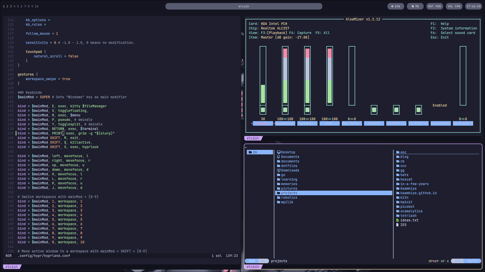

# dotfiles

All the config files I find important.

## Installed Apps

- [Firefox](https://www.mozilla.org/en-US/firefox/new/)
- [i3](https://i3wm.org/)
- [Polybar](https://polybar.github.io/)
- [feh](https://feh.finalrewind.org/)
- [Flameshot](https://flameshot.org/)
- [Helix](https://helix-editor.com)
- [WezTerm](https://wezfurlong.org/wezterm/index.html)
- [aerc](http://aerc-mail.org/)
- [Fastfetch](https://github.com/fastfetch-cli/fastfetch)
- [Starship](https://starship.rs)
- [Elvish](https://elv.sh)
- [iamb](https://iamb.chat)
- [dblab](https://github.com/danvergara/dblab)
- [gh](https://github.com/cli/cli)
- [tokei](https://github.com/XAMPPRocky/tokei)
- [superfile](https://superfile.netlify.app)
- [betterlockscreen](https://github.com/betterlockscreen/betterlockscreen)

## Stuff not shown

- OS is Void Linux, but it _may_ be portable to other Linux distros
- Cursor theme is Bibata Modern Ice
- Fetch is fastfetch
- Fonts are Roboto and JetBrains Mono Nerd Font
