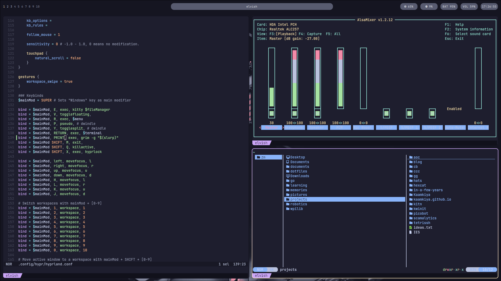

# dotfiles

All the config files I find important.

## Installed Apps

- [Zen](https://zen-browser.app)
- [Helix](https://helix-editor.com)
- [Kitty](https://github.com/kovidgoyal/kitty)
- [Fastfetch](https://github.com/fastfetch-cli/fastfetch)
- [Starship](https://starship.rs)
- [Elvish](https://elv.sh)
- [French qwerty keyboard](https://qwerty-fr.org/)
- [fuzzel](https://codeberg.org/dnkl/fuzzel)
- [Yazi](https://yazi-rs.github.io/)

## Stuff not shown

- OS: Arch Linux
- Cursors: Bibata Modern Ice
- Fetch: fastfetch
- Fonts: Segoe UI and JetBrainsMono Nerd Font
- Window Manager: Niri
- Widgets: eww
